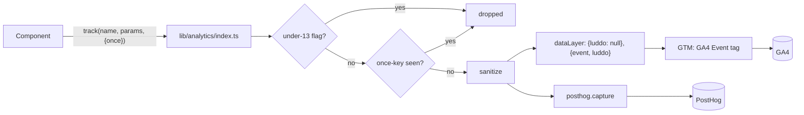
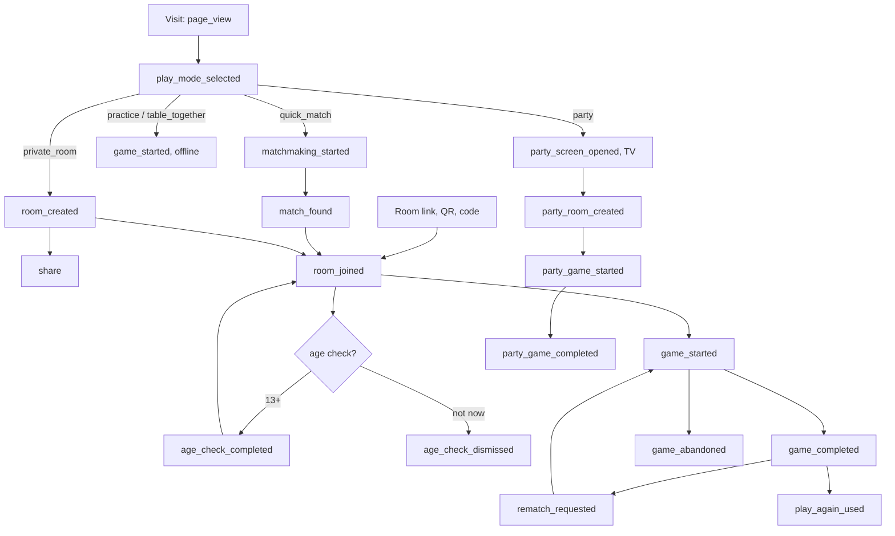

# Analytics

Luddo House measures how people find a table, play and come back, with two tools:

| Tool | Where | What it gets |
| --- | --- | --- |
| Google Analytics 4 (`G-75GZQ69MCG`), through Google Tag Manager (`GTM-N7X49V9F`) | Website only | The event catalog below, page views, scrolls and outbound clicks |
| PostHog | Website, iOS and Android apps | The same event catalog (except `page_view`), its own `$pageview`, masked session recordings, `call_ice_outcome` |

Every event goes through one typed function, `track()` in `lib/analytics`. Nothing else in the app calls `gtag()`, pushes to `dataLayer` or calls `posthog.capture()` for a domain event.

Nothing is sent from a device where someone answered under 13 or used an account the server marks under 13, no age is ever sent, and no URL, parameter or property carries a room id, room code, invite, team or cast token.

The measurement plan this was built from, with the reasoning behind each decision: [Luddo House analytics plan](https://claude.ai/code/artifact/9b131e72-b0cb-4fba-9e83-f11eb1e938bb).

## Architecture



| File | Job |
| --- | --- |
| `lib/analytics/events.ts` | The catalog: every event name and its parameter types (`EventMap`), `EVENT_NAMES`, `PARAMETER_NAMES`, `USER_PROPERTY_NAMES`. A misspelt event or parameter fails type-checking. |
| `lib/analytics/index.ts` | `track()`, `setUserProperties()`, `trackError()`, `errorCode()`, `levelBucket()` |
| `lib/analytics/sanitize.ts` | Keeps strings (≤ 100 characters), finite numbers and booleans; at most 25 parameters |
| `lib/analytics/redact.ts` | URL redaction by allow-list (below) |
| `lib/analytics/dedupe.ts` | Once-keys in `localStorage` (48 hours, 200 keys) plus memory |
| `lib/analytics/children.ts` | The under-13 off switch |
| `lib/analytics/destinations.ts` | Tag Manager and PostHog. Tag Manager code compiles out of the app build. |
| `lib/analytics/headScript.ts` | The ES5 `<head>` script (consent, gates) and the gated GTM loader |
| `lib/analytics/posthogRedact.ts` | PostHog `before_send`: cleans every URL an event carries |
| `lib/analytics/gameParams.ts` | Shared game parameters and results from a room state |
| `lib/analytics/entry.ts` | How this tab reached a room (`entry_point`, `play_context`), in `sessionStorage` |
| `lib/analytics/useRoomAnalytics.ts` | Online tables: join, start, end, takeover, reclaim, reconnects, chat and call use |
| `lib/analytics/useOfflineAnalytics.ts` | Practice and Table Together |
| `lib/analytics/usePartyScreenAnalytics.ts` | Party Mode, from the TV |
| `lib/analytics/auth.ts` | `sign_up` and `login` |
| `components/analytics/AnalyticsRoot.tsx` | Mounted once in `app/layout.tsx`: `luddo_ready`, page views, user properties, auth listener |
| `scripts/generate-gtm-container.ts` | Writes `docs/gtm-container.json` from the catalog |

**Page load, website.** `app/layout.tsx` puts `analyticsHeadScript()` first in `<head>`. In ES5, so Chromium 79 TVs run it, it:

1. sets up `dataLayer` and a `gtag` stub;
2. stops if either under-13 flag is set, and sets `window['ga-disable-G-75GZQ69MCG'] = true`;
3. stops unless the host is `luddohouse.com` or `www.luddohouse.com`, or GTM Preview (`?gtm_debug=`) or `localStorage['luddo-analytics-debug'] = '1'` asks for it. Hits from any other host are marked `debug_mode`;
4. pushes Consent Mode defaults (below);
5. sets `window.__luddoTagsOn = true`.

The GTM loader (`next/script`, `afterInteractive`) runs only when `__luddoTagsOn` is true. There is no direct `gtag.js` snippet any more, and no `<noscript>` iframe.

**`luddo_ready`.** Pushed once, when the account hold releases (below), and by `sendToTagManager()` before any event that comes first. The container's Google tag fires only on it, so publishing the container before the new code deploys changes nothing on the old site.

**Each event** is two pushes: `{luddo: null}`, then `{event: name, luddo: params}`. GTM's data model merges objects, so without the reset an event would inherit the previous event's parameters (a `share` carrying the last game's `finish_place`).

**Page context.** Before the first event, and on every pathname change, the page is set as top-level `page_location`, `page_referrer`, `page_title` keys and with `gtag('set', …)`, so GA's automatic events (scrolls, outbound clicks) use the cleaned URL too.

**User properties** live under `luddo_user` and persist in GTM's data model; PostHog gets them through `posthog.register()`.

**The app build** (`npm run build:capacitor`, `CAPACITOR_BUILD=1`) leaves out the head script and the GTM loader, and `next.config.ts` sets `LUDDO_APP_BUILD=1`, so every Tag Manager branch in `lib/analytics` compiles out. The built `out/` folder contains no `googletagmanager`, `G-75GZQ69MCG`, `GTM-N7X49V9F`, `dataLayer` or `gtag`. The apps report to PostHog only.

## Player journey



Every online way in (quick match, a room code, a link, a QR, a team table, a tournament table) ends at `/room?id=…`. The place that sends the player there tags the room in `sessionStorage` first; an untagged room counts as `invite_link` (or `party_qr` at a party table).

## Event catalog

40 events. Values are codes, never translated text. Recommended GA event names (`page_view`, `share`, `sign_up`, `login`, `join_group`, `level_up`) are used where they fit.

### Shared game parameters

Sent on `game_started`, `game_completed` and `game_abandoned`.

| Parameter | Values |
| --- | --- |
| `game_id` | The match UUID online (grants nothing: replays are participant-only); `local-` plus a random hex id offline |
| `game_type` | `luddo`, `snakes_ladders` |
| `game_mode` | One headline mode: `team_up` > `rush` > the preset the rules match (`classic`, `quick`, `master`, `family`) > `custom` |
| `rules_customized` | `true` when the rules match no preset |
| `play_context` | `practice`, `table_together`, `private_room`, `quick_match`, `party`, `tournament`, `team` |
| `seat_count`, `human_count`, `bot_count` | Seats at the table |
| `bot_difficulty` | `easy`, `normal`, `hard` (practice) |
| `turn_timer_s` | Seconds per turn (the party timer at a party table) |

### Getting to a table

| Event | Parameters | Sent when |
| --- | --- | --- |
| `page_view` | `page_location`, `page_referrer`, `page_title` | Load and every pathname change (a query change alone is not a page). GA only; PostHog has `$pageview`. |
| `play_mode_selected` | `play_mode`: `quick_match`, `private_room`, `practice`, `table_together`, `party` | A way of playing is chosen at the entrance |
| `room_created` | `game_type`, `seat_count`, `play_context` (`private_room`, `team`) | A private or team table is created |
| `share` | `method` (`share_sheet`, `copy`, `download`), `content_type` (`room_invite`, `room_code`, `watch_link`, `team_invite`, `highlight_clip`, `friend_code`) | An invite, code or clip is shared or copied |
| `room_joined` | `play_context`, `entry_point`, `role` (`host`, `player`, `audience`), `game_type` | First time this seat is in this room |
| `matchmaking_started` | `game_type`, `seat_count` | Quick match search begins |
| `match_found` | `game_type`, `seat_count`, `human_count`, `bot_count`, `wait_seconds` | Quick match seats the player |
| `matchmaking_cancelled` | `wait_seconds` | The player cancels the search |
| `play_again_used` | `is_friend` | "Play again" joins a recent table |
| `watch_started` | — | A watch link is opened and joined |
| `age_check_completed` | `context` (`online_table`, `sign_in`, `party`) | The server accepts a 13+ answer. The answer itself is never sent. |
| `age_check_dismissed` | `context` | "Not now" on the age screen |
| `sign_up` | `method` (`google`, `apple`, `email_code`, `phone_code`, `game_center`), `from_guest` | A new account, or a guest who linked one |
| `login` | `method` | An existing account signs in |

`entry_point`: `created`, `invite_link`, `room_code`, `play_again`, `rematch`, `quick_match`, `tournament`, `team`, `party_qr`, `offline`.

### Game lifecycle

| Event | Parameters | Sent when |
| --- | --- | --- |
| `game_started` | Shared, plus `entry_point`, `is_host`, `lobby_wait_seconds` (first game in a room only) | A game starts for this seat (online), or a new offline game starts |
| `game_completed` | Shared, plus `duration_seconds`, `finish_place`, `won`, `turn_count`, `captures`, `sixes`, `pawns_home`, `missed_decisions`, `seat_taken_over`, `used_chat`, `used_call`, `reaction_count`, `end_reason` (`all_placed`, `first_home`, `clock`) | The results screen, for a seat that saw the start. Online stats come from `get_match_results`; offline games send place and `won` only. |
| `game_abandoned` | Shared, plus `abandon_reason` (`left_table`, `match_abandoned`, `restarted`), `duration_seconds` | The player leaves a running game from the menu, the match is abandoned, or an unfinished offline game is replaced |
| `rematch_requested` | `role` (`proposer`, `accepter`) | Rematch tapped on the results screen |

A rematch is a new `game_started` with `entry_point: rematch`. Leaving an offline game is not an abandonment: it waits in the save to be resumed.

### Party Mode

The TV is the one device that sees every party game once, so it reports games; phones report only their own seats.

| Event | Parameters | Sent by |
| --- | --- | --- |
| `party_screen_opened` | `has_room` | TV, once per load |
| `party_room_created` | `game_type` | TV |
| `party_game_started` | `game_id`, `game_type`, `game_mode`, `human_count`, `bot_count`, `remote_count`, `audience_count` | TV |
| `party_game_completed`, `party_game_abandoned` | The same, plus `duration_seconds` | TV |
| `party_table_paused` | — | TV, when the table waits for a dropped phone |
| `party_pause_ended` | `outcome` (`reconnected`, `computer_took_over`, `carried_on`) | TV |
| `party_controller_joined` | `role` (`vip`, `player`, `audience`), `remote` | Phone |
| `cast_started` | `is_party` | Phone that casts to a TV |

### Seats and reliability

| Event | Parameters | Sent when |
| --- | --- | --- |
| `seat_taken_over` | `reason` (`timeouts`, `disconnect`), `play_context` | A computer takes this seat |
| `seat_reclaimed` | `play_context` | The player takes it back |
| `realtime_reconnected` | `offline_seconds`, `game_phase` (`lobby`, `in_game`, `summary`) | The live connection returns after 3 s or more |
| `realtime_reconnect_failed` | `game_phase` | Still offline after 60 s |
| `app_error` | `area` (`room_access`, `join`, `create`, `matchmaking`, `start`, `rematch`, `reclaim`, `three_d`), `error_code` | Once per area and code per page |

An outage the page spent in the background (a phone locked or switched away) is not counted: the connection drops there on purpose.

`error_code` is an `RpcErrorCode` (`lib/supabase/rpc.ts`) or one of the 3D table's codes (`components/analytics/ThreeDErrors.tsx`): `scene_crash` (the scene threw), `webgl_unavailable` (a probe context could not be opened) and `context_lost` (the GPU dropped the table's context while it was open). Every `AGE_*` code is excluded: `AGE_RESTRICTED` means a child. Messages are never sent; an unrecognised error is `UNKNOWN`.

Nothing that reports goes in the Canvas `fallback`: React Three Fiber renders it inside the `<canvas>` element on every browser, so it mounts for everyone. And the table's own exit forces a context loss (React Three Fiber frees the GPU that way), so the `context_lost` listener lives inside the Canvas and goes when the table closes.

### Social, progression and trust

| Event | Parameters | Sent when |
| --- | --- | --- |
| `call_joined` | — | Once per game (or per lobby) that this player joins the call |
| `friend_request_sent` | `method` (`code`, `recent_table`, `seat`) | A friend request is sent |
| `friend_request_accepted` | — | An incoming request is accepted |
| `level_up` | `level` | The results screen shows a higher level than at the start |
| `dice_check_run` | `result` (`verified`, `mismatch`), `reason` | "Check the dice" on the results screen |
| `join_group` | `group_type: team` | A team is joined |
| `tournament_created` | `size`, `game_type` | |
| `tournament_joined` | — | |

### User properties

| Property | Values |
| --- | --- |
| `player_type` | `visitor`, `guest`, `signed_in` |
| `app_locale` | The app language code |
| `colorblind_mode`, `reduced_motion` | Booleans |
| `graphics_quality` | `low`, `medium`, `high`, `ultra` |
| `level_bucket` | `1`, `2-4`, `5-9`, `10-19`, `20+` |

Never an age or age bucket.

### Example

```json
{
  "event": "game_completed",
  "luddo": {
    "game_id": "8b0f3c1e-…",
    "game_type": "luddo",
    "game_mode": "classic",
    "rules_customized": false,
    "play_context": "private_room",
    "seat_count": 4,
    "human_count": 2,
    "bot_count": 2,
    "turn_timer_s": 15,
    "duration_seconds": 1260,
    "finish_place": 1,
    "won": true,
    "turn_count": 31,
    "captures": 3,
    "sixes": 7,
    "pawns_home": 4,
    "missed_decisions": 0,
    "seat_taken_over": false,
    "used_chat": true,
    "used_call": false,
    "reaction_count": 4,
    "end_reason": "all_placed"
  }
}
```

## Counting rule

Game events are **per player**: a four-person game sends four `game_started` and up to four `game_completed`, all with the same `game_id`.

- Players who played = users with `game_started`. Player-games = the count of `game_started`.
- Matches = distinct `game_id` (BigQuery, or a Free-form exploration with `game_id` registered later). In GA's standard reports, `game_started` with `is_host = true` is the estimate; offline games are always `is_host = true`.
- Completion rate = `game_completed` ÷ `game_started` for the same breakdown.
- Supabase `matches` and `match_results` are the source of truth for match counts, durations and outcomes. GA is for behaviour, funnels and acquisition.

**Duplicate protection.** Lifecycle events carry a once-key (`game_started:<match>:<seat>`, `game_done:<match>:<seat>`, `room_joined:<room>:<seat>`, `party_game_started:<match>` and so on) recorded before sending. A refresh, a reconnect replaying a snapshot, React Strict Mode or two tabs on one table cannot send it twice. A `game_completed` is only sent for a game this device saw start.

## Identity

There is no GA User-ID. GA counts devices (its own `client_id`); PostHog uses its anonymous ID with no `identify` call. `player_type` says whether the device is a visitor, a guest or signed in. `game_id` is the only id in events.

**Sign-in.** The click that starts a sign-in notes the method and the user before it in `sessionStorage` (it survives the OAuth redirect in the same tab). When an account appears on any auth event:

| What happened | Event |
| --- | --- |
| The same user id that was an anonymous guest | `sign_up` with `from_guest: true` |
| A user created in the last 10 minutes | `sign_up` with `from_guest: false` |
| Anything else | `login` |

Restored sessions, token refreshes and other tabs have no note, so they send nothing. A magic link opened in another tab is not counted. The event waits for the account's age answer (`get_age_eligibility`): an account the server marks under 13 turns analytics off instead, and a failed check sends nothing.

## Privacy

### Under-13 off switch

Two device flags turn every destination off. Both hold the day the block lifts (`YYYY-MM-DD`) and are checked before Tag Manager may load (the head script) and before PostHog opts back in (`instrumentation-client.ts`).

| Flag | Written when |
| --- | --- |
| `luddo-under-13-until` | This device answered under 13 (`blockDeviceUntil`, `lib/community.ts`) |
| `luddo-analytics-off-until` | An account the server marks under 13 is used here: the age screen's under-13 result, `AGE_RESTRICTED` from any join, `UnderAgeNotice`, the sign-in age gate, a watch link. Holds until the server's `eligibleFrom`, or a year when it gives none. |

`stopAnalyticsForChild()` also stops the current page at once: it sets `ga-disable-G-75GZQ69MCG`, clears `__luddoTagsOn`, and opts PostHog out and stops its recording. Only a 13+ answer the server accepts is ever reported, as `age_check_completed` with its context.

**The account hold.** A signed-in account can be under 13 on a device that has no flag yet (a first sign-in there). So `AnalyticsRoot` holds every `track()` call (up to 50) from page load until the auth state is known, and for a signed-in account until `get_age_eligibility` answers. A visitor or guest is released at once. An account marked under 13 sets the flag and drops what waited; a failed or slow check (8 s) drops it too. `luddo_ready` is pushed only on release, so the Google tag never starts for that child.

### URL redaction

`page_location` keeps the origin, the path and only these query keys: `play`, `ref` (Product Hunt's `?ref=producthunt`), `utm_source`, `utm_medium`, `utm_campaign`, `utm_content`, `utm_term`, `utm_id`. Everything else and the fragment are dropped. `page_referrer` from this site is cleaned the same way; another site's referrer keeps only its origin.

| Link | What it carries | Sent as |
| --- | --- | --- |
| `/room?id=<room>` | The invitation to the table | `/room` |
| `/watch?room=<room>&cast=<token>` | Watch access | `/watch` |
| `/screen?id=<room>&cast=<token>` | TV access | `/screen` |
| `/?team=<code>` | Team invite | `/` |
| `?code=…`, `?error_description=…`, `#access_token=…` | OAuth | dropped |
| `/replay?match=<id>` | A match id | `/replay` |

PostHog gets the same treatment in `before_send`: every property whose name ends in `url`, `referrer` or `href` (`$current_url`, `$referrer`, their `$initial_` and `$session_entry_` copies), clicked links in autocapture (`$elements_chain`, `$elements`), and the page address in session-replay meta events, in the website and the apps. GA4's own "Redact URL query parameters" (`id`, `room`, `cast`, `team`, `code`, `match`, `sb_flow_id`, `error_code`, `error_description`) is the backstop.

**Never sent:** names, display names, emails, phone numbers, chat or reaction text, profile fields, Supabase user ids, room ids, room codes, team codes, cast tokens, ages, birth dates, error messages.

## Consent

Consent Mode v2 defaults, pushed by the head script before Tag Manager loads:

| Region | `analytics_storage` | `ad_storage`, `ad_user_data`, `ad_personalization` |
| --- | --- | --- |
| EEA, Iceland, Liechtenstein, Norway, UK, Switzerland | denied | denied |
| Everywhere else | granted | denied |

Both GTM tags require `analytics_storage` (basic consent mode), so in those regions nothing fires and no GA cookie is set. There is no banner yet; adding one later means a CMP that sends `gtag('consent', 'update', …)`. Google signals stays off. No ad features are used.

## PostHog

- `instrumentation-client.ts` initialises PostHog on the website and in the apps, with `before_send: redactPostHogEvent`.
- Every catalog event except `page_view` goes to PostHog with the same parameters; user properties are super properties (`posthog.register`).
- The child switch opts PostHog out; the opt-out lifts only when both flags have.
- Session recordings mask all text and inputs; the PostHog project's own masking setting must match (`docs/STORE_DISCLOSURES.md`).

## Google Tag Manager

The container is generated from the catalog, never edited by hand in GTM.

```sh
npm run analytics:gtm -- 6380212474 265907052   # GTM account and container ids
```

writes `docs/gtm-container.json`, and `tests/analytics/gtmContainer.test.ts` fails if the file is out of date. It holds:

| Item | Configuration |
| --- | --- |
| 54 Data Layer Variables | `DLV - luddo.<parameter>` for each event parameter (incl. `debug_mode`), `DLV - page_location`, `DLV - page_referrer`, `DLV - page_title` |
| 6 Data Layer Variables | `DLV - luddo_user.<property>` |
| `Event Settings - Luddo` | Event settings variable: the three page keys, and the six user properties |
| `CE - luddo_ready` | Custom event equals `luddo_ready` |
| `CE - Luddo catalog` | Custom event matching `^(page_view|play_mode_selected|…|tournament_joined)$` (all 40) |
| `Google tag - Luddo House` | Google tag `G-75GZQ69MCG`, `send_page_view: false`, shared event settings, once per page, on `CE - luddo_ready`, requires `analytics_storage` |
| `GA4 Event - Luddo catalog` | GA4 Event, name `{{Event}}`, every parameter mapped to its DLV (empty ones are not sent), shared event settings, on `CE - Luddo catalog`, requires `analytics_storage` |

**To change it:** edit `events.ts`, run the generator, then in GTM: Admin → Import Container → the file → an unpublished workspace → Merge → "Overwrite conflicting tags, triggers and variables". Check it in Preview, then publish.

**Preview.** Tag Assistant needs a page running the new code: production after deploy, or a Vercel preview (the head script lets `?gtm_debug=` through on any host and marks those hits debug). Locally, `localStorage.setItem('luddo-analytics-debug', '1')` turns Tag Manager on for any host.

## Google Analytics 4

Property `554915319`, web stream `15805270706`, measurement ID `G-75GZQ69MCG`.

**Applied (2 October 2026):**

| Setting | Value |
| --- | --- |
| Unwanted referrals | `accounts.google.com`, `appleid.apple.com` |
| Internal traffic | Rule "Owner home network" (one IPv4 address); Internal Traffic filter Active |
| Developer Traffic filter | Active: `debug_mode` hits (Preview, DebugView, non-production hosts) stay out of reports |
| Redact URL query parameters | `id`, `room`, `cast`, `team`, `code`, `match`, `sb_flow_id`, `error_code`, `error_description` |
| Enhanced measurement | Page views, scrolls, outbound clicks on; form interactions, site search, video and file downloads off |
| Event data retention | 14 months |
| Stream URL | `https://www.luddohouse.com`; configured domain `luddohouse.com` |
| History-based page views | Off ("Page changes based on browser history events"): the app sends its own `page_view`. Page loads stay on. |

**Created after the code went live (2 October 2026).** Custom definitions can only be archived, not deleted.

Event-scoped dimensions (27): `game_type`, `game_mode`, `play_context`, `entry_point`, `bot_difficulty`, `rules_customized`, `is_host`, `seat_count`, `human_count`, `bot_count`, `play_mode`, `method`, `content_type`, `role`, `abandon_reason`, `end_reason`, `reason`, `outcome`, `area`, `error_code`, `game_phase`, `won`, `seat_taken_over`, `used_chat`, `used_call`, `from_guest`, `result`.

Custom metrics (10): `duration_seconds`, `lobby_wait_seconds`, `wait_seconds`, `offline_seconds` (unit: seconds); `turn_count`, `captures`, `sixes`, `pawns_home`, `missed_decisions`, `reaction_count` (standard).

User-scoped dimensions (6): `player_type`, `app_locale`, `colorblind_mode`, `reduced_motion`, `graphics_quality`, `level_bucket`.

Not registered on purpose: `game_id` (unique per game; BigQuery), `finish_place`, `turn_timer_s`, `level`, `size`, `context`, `is_friend`, `remote`, `remote_count`, `audience_count`, `has_room`, `is_party`.

Key events: `game_started`, `game_completed`, `sign_up` (Admin → Events → Create event → Create with code, no default value, once per event) and `invite_accepted`. `invite_accepted` is a custom event on the web stream (Data streams → the stream → Create custom events): `event_name` equals `room_joined` and `entry_point` equals `invite_link`, copying the source event's parameters. `purchase` stays listed: GA no longer lets it be unmarked, and nothing sends it.

Audiences (30-day membership): Played 2+ games (`game_completed` event count > 1); Guests who played online (`player_type` exactly matches `guest`, and `game_started` with `play_context` not matching `^(practice|table_together)$`); Party hosts (TV) (`party_game_started`).

**BigQuery export (prepared, not linked).** Needs a Google Cloud project with billing and the owner accepting terms. Then: Admin → Product links → BigQuery links → Link → choose the project → data location → Daily export (Streaming is optional and costs more) → include web stream `15805270706` → Submit. Matches per day:

```sql
SELECT event_date,
       COUNT(DISTINCT (SELECT value.string_value FROM UNNEST(event_params) WHERE key = 'game_id')) AS matches
FROM `PROJECT.analytics_554915319.events_*`
WHERE event_name = 'game_started'
GROUP BY event_date
ORDER BY event_date;
```

## Rollout

Done on 2 October 2026, in this order:

1. Published the GTM container as version 3, "Luddo catalog v1". Safe before deploy: its Google tag waits for `luddo_ready`, which only the new code pushes.
2. Deployed (`develop` → Vercel production). The direct `gtag.js` snippet is gone; GTM now carries GA. Checked on www.luddohouse.com: `luddo_ready`, then a `page_view` with the cleaned URL and user properties, from Tag Manager.
3. Turned off history-based page views in the stream.
4. Created the custom definitions, key events, the `invite_accepted` rule and the three audiences.

Still to do: a full game in a private room on production, watched in DebugView (`?gtm_debug` through Tag Assistant marks the hits debug). Never use public quick match for this: it pairs you with real players.

For later releases: if new code that depends on a container change deploys before the container is published, the new events go unmeasured until it is.

## Funnels and reports

Explore → Funnel exploration, "indirectly followed" steps unless noted.

| Funnel | Steps | Notes |
| --- | --- | --- |
| Visitor to player, online | `session_start` → `play_mode_selected` (online modes) → `age_check_completed` → `room_joined` or `match_found` → `game_started` | Run with and without the age step; it appears only while the server's age check is on |
| Visitor to player, offline | `session_start` → `play_mode_selected` (`practice`, `table_together`) → `game_started` | |
| Invite loop, host | `room_created` → `share` (`room_invite`, `room_code`) → `game_started` (`is_host`, `human_count` ≥ 2) → `game_completed` | A started game with a second human is the proof a friend came |
| Invite loop, friend | `page_view` on `/room` → `room_joined` (`invite_link`, `room_code`) → `game_started` → `game_completed` | Links that worked = `invite_accepted` ÷ `share` of `room_invite`, across users |
| Quick match | `matchmaking_started` → `match_found` → `game_started` (`quick_match`) → `game_completed` | `match_found` with `human_count = 1` means nobody else was searching |
| Party Mode | `party_screen_opened` → `party_room_created` → `party_game_started` → `party_game_completed` | All on the TV; phones per game = `human_count` |
| Completion | `game_started` → `game_completed`, against `game_abandoned` | Break down by `play_context`, `game_mode`, `seat_count`, `seat_taken_over` |
| Rematch | `game_completed` → `rematch_requested` → `game_started` (`entry_point = rematch`) | `play_again_used` is its own count |
| Offline to online | `game_started` (`practice`) → `game_started` (an online context) | |
| Guest to account | `game_started` → `sign_up` (`from_guest = true`), by `method` | |
| Retention | Cohort exploration: first `game_completed`, returning on `game_completed` | Streaks come from Supabase |

Useful standard reports once the dimensions exist: Events by `play_context` and `game_mode`; Traffic acquisition with `game_started` as the key event; `app_error` by `area` and `error_code`; `realtime_reconnect_failed` by `game_phase`.

## Known gaps

| Gap | Why | Where the truth is |
| --- | --- | --- |
| App players in GA | GA is left out of the app | PostHog |
| Closing the tab mid-game | A refresh and a close look the same | Supabase: null `placement`, `ended_under_takeover` |
| A taken-over player who never returns | The device that lost the seat is gone | Supabase `match_results` |
| Matches abandoned with nobody connected | Rarely seen by a client | Supabase `matches.end_reason` |
| Offline captures, sixes, turns | Not counted by the offline engine | Not recorded |
| Table Together places | Several people share one device | Not attributable |
| Achievements, cosmetics, streaks | The client never sees the moment | Supabase |
| Online duration | Measured from this device's first sight of the game | Supabase `matches` |
| Entry points | QR scans, push taps and pasted links all arrive as `invite_link` | A tracking parameter on push links would separate them |
| "Play again" context | Joins from the recent-tables strip are tagged `private_room`; the table could be a team, tournament or quick-match table | Supabase `rooms` |
| PostHog before the account check | PostHog's own `$pageview`, autocapture and recording start at init, before an under-13 account on a new device is known; they stop when the check answers | GA gets nothing (the account hold) |
| Host to friend, TV to phone | Different GA users | Ratios across users, or BigQuery on `game_id` |
| Europe | GA off there | PostHog; a consent banner later |
| Ad blockers, private browsing | GA requests blocked | Supabase |
| A party TV closed mid-game | Each TV reports for itself | Supabase `matches` |
| A matched or tournament player who never opens the table | The server seats them | Supabase |
| False 3D errors on 2 October 2026 | From the first deploy (about 11:00 PT) until the fix went live, every 3D table sent `app_error` `three_d` / `webgl_unavailable` on opening and `context_lost` on leaving | Exclude `area = three_d` for that window; `scene_crash` was unaffected |

## Testing

- `npm test` runs `tests/analytics`: the catalog's names and types (with `@ts-expect-error` checks that `npx tsc --noEmit` enforces), sanitizing, redaction, de-duplication, the under-13 switch, the head script (parsed as ES5, run against stand-in windows), game parameters, sign-in events, PostHog redaction, the 3D table's WebGL probe (and that nothing reports from the Canvas fallback) and the GTM file.
- Locally: build, `next start -p 3917`, then in the console `localStorage.setItem('luddo-analytics-debug', '1')` and reload. `dataLayer` shows every push; nothing reaches GA without network access to Google.
- App build: `npm run build:capacitor`, then `grep -rlE "googletagmanager|G-75GZQ69MCG|GTM-N7X49V9F|dataLayer" out` prints nothing.
- 3D table errors: on the local build, open `/practice`, leave with a client-side navigation, and `dataLayer` holds no `app_error`; `loseContext()` on the table's context mid-game gives one `context_lost`; a browser launched with `--disable-webgl --disable-3d-apis` gives one `webgl_unavailable`.
- Production: private rooms only.

## Adding an event

1. Add it to `EventMap` and `EVENT_NAMES` in `lib/analytics/events.ts`, and any new parameter to `PARAMETER_NAMES`. Values are codes; never a name, id that grants access, free text or age.
2. Call `track()` where it happens, with a `once` key if a refresh or reconnect could repeat it.
3. `npm run analytics:gtm -- 6380212474 265907052`, commit the JSON, import it into GTM, Preview, publish.
4. Register a custom definition in GA only if reports need the new parameter.
5. Update this file and, if the data is new in kind, `app/privacy/page.tsx` and `docs/STORE_DISCLOSURES.md`.
